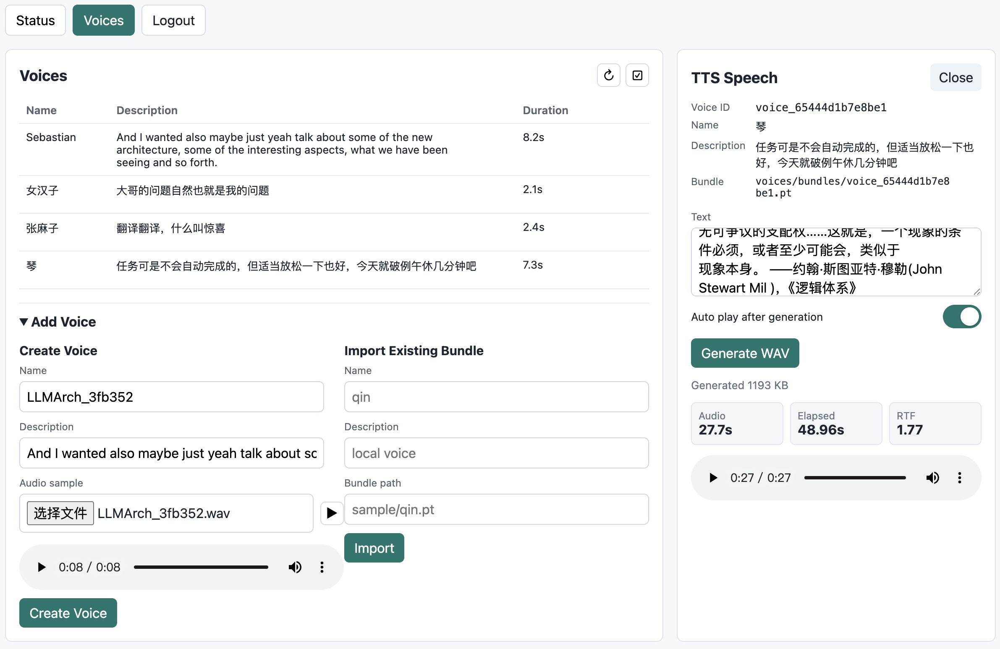
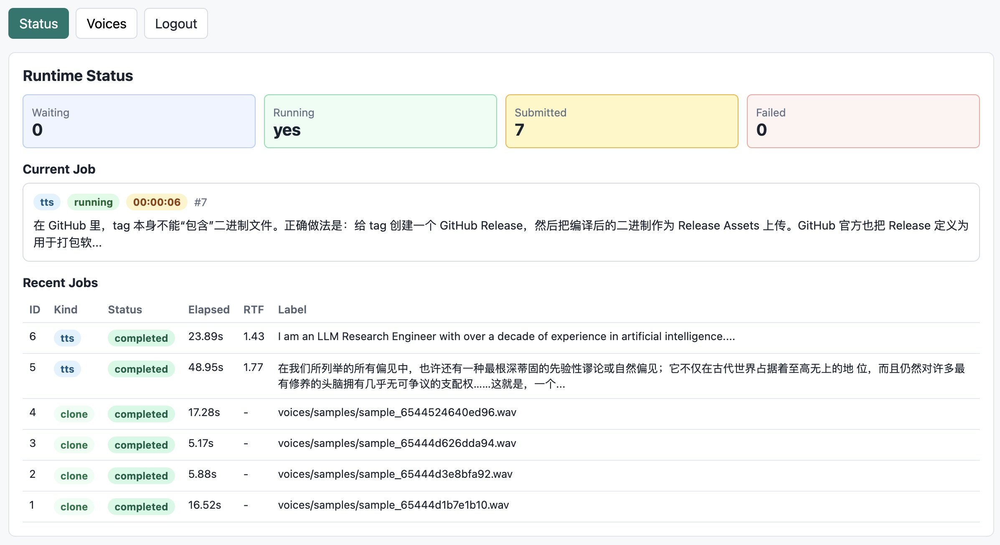

# IndexTTS2 Metal

中文 | [English](README.md)

IndexTTS2 Metal 是面向 Apple Silicon 优化的 IndexTTS2 原生运行时。项目以
PyTorch 版本 IndexTTS2 的模型结构为起点，将权重转换为固定的 MIT2 bundle，并通过
C++/Objective-C++、Metal 与 MetalPerformanceShaders 在 macOS 上运行推理。

## 功能介绍

- Apple Silicon 专门优化：针对 M 系列芯片使用原生 Metal kernel 和 MPS 算子。
- PyTorch 到原生格式转换：将 IndexTTS2 checkpoint 转换为适合 mmap 的 MIT2 模型
  bundle，包含对齐后的权重数据和 manifest 校验。
- 原生 TTS 运行时：使用模型 bundle、音色 bundle 和输入文本合成语音，不再走原始
  PyTorch 推理路径。
- 原生音色克隆：当模型 bundle 中包含克隆编码器权重时，可从参考音频生成音色
  bundle。
- HTTP 服务与内置 Web UI：可作为本地服务运行，也可开启浏览器管理界面。
- 速度/质量控制：通过 CFM 合成步数调节推理速度与声学质量之间的取舍。

## 性能对比

本项目使用 C++ 为 Apple Silicon 重写了 IndexTTS2 推理引擎。本地测试中，原生
Metal 运行时相比 PyTorch 版本 IndexTTS2 降低了 RTF：

| 硬件 | PyTorch IndexTTS2 RTF | IndexTTS2 Metal RTF |
| --- | ---: | ---: |
| M1 Max 64G | 2.28 | 1.71 |
| M3 Ultra 256G | 2.20 | 0.82 |

## 运行要求

- Apple Silicon Mac。
- 支持 Metal 与 MetalPerformanceShaders 的 macOS。
- Xcode Command Line Tools。
- CMake 3.20 或更新版本。
- Apple Clang 提供的 C++17 / Objective-C++17 编译器。
- Python 3.10 或更新版本，用于模型转换和辅助工具。
- `pyproject.toml` 中声明的 Python 依赖；只有读取原始 PyTorch checkpoint 或 `.pt`
  音色文件时才需要 PyTorch 相关额外依赖。
- 已转换的 MIT2 模型 bundle，通常放在 `bin/`。
- 一个或多个已转换音色 bundle，可导入服务的 voice store，也可直接传给 `--tts`。

需要使用转换工具时，可在本地安装 Python 包：

```bash
python -m pip install -e ".[torch,dev]"
```

## 模型资源

`mtts` 运行时依赖转换后的 MIT2 模型文件。可以二选一使用下面的模型资源：

1. Hugging Face：[raoqu/index-tts2-metal](https://huggingface.co/raoqu/index-tts2-metal)
2. 魔搭 ModelScope：[iwannaido/index-tts2-metal](https://modelscope.cn/models/iwannaido/index-tts2-metal)

可以将模型文件下载到默认的 `bin/` 目录：

```bash
mkdir -p bin
git clone https://huggingface.co/raoqu/index-tts2-metal bin
```

也可以下载到任意目录，并在 server/web 模式通过 `--model_bundle` 指定：

```bash
./build/mtts --web \
  --host 127.0.0.1 \
  --port 3456 \
  --model_bundle /path/to/index-tts2-metal
```

命令行直接合成时，`--tts` 后的第一个位置参数就是模型 bundle 路径：

```bash
./build/mtts --tts /path/to/index-tts2-metal /path/to/voice-bundle "要合成的文本。" out.wav
```

## 编译

编译原生运行时：

```bash
./build.sh
```

脚本会在 `build/` 中配置 CMake，并生成 `mtts` 可执行文件：

```text
build/mtts
```

也可以覆盖构建目录、构建类型或并行数：

```bash
BUILD_DIR=build-release CMAKE_BUILD_TYPE=Release JOBS=8 ./build.sh
```

## 运行

### 转换模型 bundle

如果已经有转换好的 MIT2 模型 bundle，可以跳过本步骤。否则，将 PyTorch
IndexTTS2 checkpoint 目录转换为原生 bundle：

```bash
python -m metal_indextts2.tools.convert_model \
  --checkpoint-dir /path/to/index-tts2/checkpoints \
  --output bin \
  --force-dtype f16
```

如果需要原生音色克隆，可在转换时额外加入 semantic codec、BigVGAN、CAMPPlus、
W2V-BERT 等组件。

### 启动 HTTP API

```bash
./build/mtts --server \
  --host 127.0.0.1 \
  --port 3456 \
  --model_bundle bin
```

### 启动 Web UI

`--web` 会隐含启用 `--server`，并在 `/web` 暴露内置页面：

```bash
./build/mtts --web \
  --host 127.0.0.1 \
  --port 3456 \
  --model_bundle bin
```

打开：

```text
http://127.0.0.1:3456/web
```

### 命令行 TTS

```bash
./build/mtts --tts bin voices/bundles/qin "今天的天气不错，我们去划船吧。" out.wav
```

较低的 CFM 步数速度更快，较高的步数通常能保留更多声学质量。实际运行参数名为
`--cfm_steps`：

```bash
./build/mtts --cfm_steps 16 --tts bin voices/bundles/qin "今天的天气不错，我们去划船吧。" out.wav
```

### 克隆音色

使用参考 WAV 文件创建原生音色 bundle：

```bash
./build/mtts --clone bin sample/reference.wav voices/bundles/demo
```

### 运行参数

这里只列出主要产品入口参数。

| 参数 | 说明 |
| --- | --- |
| `--web` | 启动 HTTP 服务，并在 `/web` 启用内置 Web UI。 |
| `--server` | 只启动 HTTP API，不暴露 Web UI。 |
| `--host HOST` | server/web 模式监听地址。默认：`127.0.0.1`。 |
| `--port PORT` | server/web 模式监听端口。默认：`3456`。 |
| `--cfm_steps N` | 设置 CFM 合成步数。有效范围：`12` 到 `25`。 |
| `--clone MODEL_BUNDLE AUDIO_WAV OUTPUT_VOICE_BUNDLE` | 从参考 WAV 文件创建原生音色 bundle。 |
| `--tts MODEL_BUNDLE VOICE_BUNDLE TEXT OUTPUT_WAV` | 使用模型 bundle 和音色 bundle 将文本合成为 WAV 文件。 |
| `--model_bundle DIR` | server/web 模式使用的模型 bundle 目录。默认：`MODEL_BUNDLE` 或 `bin`。 |

## 截图

### 音色管理

音色管理页面用于查看已导入或克隆的音色，支持从参考音频创建音色、导入已有
bundle，并使用选中的音色测试 TTS 输出。



### Web 仪表板

Web 仪表板展示运行时状态、队列状态、当前任务、近期任务，以及合成请求的耗时和
RTF 指标。


